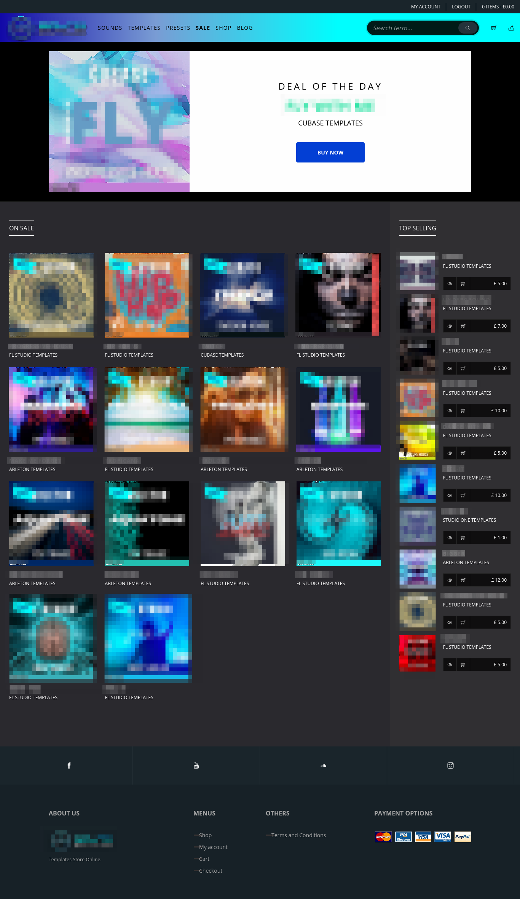

<!-- PROJECT LOGO -->
 

  

<h3 align="center">A completely custom WordPress theme with fully customized WooCommerce and Dokan multi-vendor support, with a custom music player.</h3>

  

    This is a deploy-ready theme for music selling store, stunning and modern design, supports payment gateways, SASS files included. All the necessary aspects of WooCommerce and Dokan has been customized to align with the look and feel of the theme design.
     
  

<!-- TABLE OF CONTENTS -->

  
Table of Contents

  <ol>
    <li>
      <a href="#about-the-project">About The Project</a>
      <ul>
        <li><a href="#built-with">Built With</a></li>
      </ul>
    </li>
    <li>
      <a href="#getting-started">Getting Started</a>
      <ul>
        <li><a href="#prerequisites">Prerequisites</a></li>
        <li><a href="#installation">Installation</a></li>
      </ul>
    </li>
    <li><a href="#usage">Usage</a></li>
    <li><a href="#roadmap">Roadmap</a></li>
    <li><a href="#license">License</a></li>
    <li><a href="#contact">Contact</a></li>
  </ol>

<!-- ABOUT THE PROJECT -->

## About The Project

(<a href="#top">back to top</a>)

### Built With

-   [Wordpress](https://wordpress.org/)
-   [Bootstrap](https://getbootstrap.com)
-   [jQuery](https://jquery.com)
-   [MySQL](https://mysql.com)

(<a href="#top">back to top</a>)

<!-- GETTING STARTED -->

## Getting Started

Clone the repo and install as instructed below.

### Prerequisites

You will need WordPress ~5+. Here are some of the things I have done in the project-

1. Custom WordPress theme
2. Complete WooCommerce customizations
3. Complete DOkan customizations
4. Custom fields for product/music uploads, custom preview image and mp3 file upload
5. WooCommerce custom fields integrated with Dokan uploads
6. Custom search and filtering
7. Blogging templates included
8. CSS managed with SASS, files included
9. Custom music player built to pre-play the sample music

### Installation

1. First clone this repository to your themes folder of the WordPress installation.

2. Install the plugins necessary, i.e, WooCommerce, Dokan multi-vendor plugin.

3. Done! You are good to go.

(<a href="#top">back to top</a>)

<!-- USAGE EXAMPLES -->

## Usage

You can use the theme to deploy a complete music store online. Users can pre-play sample msuic and buy them to get the original files.

(<a href="#top">back to top</a>)

<!-- ROADMAP -->

## Roadmap

-   [ ] Improve the player functionality

See the [open issues](https://github.com/rpmcmurphy/sound-boutiques-theme/issues) for a full list of proposed features (and known issues).

(<a href="#top">back to top</a>)

<!-- LICENSE -->

## License

Distributed under the MIT License. See `LICENSE.txt` for more information.

(<a href="#top">back to top</a>)

<!-- CONTACT -->

## Contact

[@ParbezRipon](https://twitter.com/ParbezRipon)

(<a href="#top">back to top</a>)

<!-- MARKDOWN LINKS & IMAGES -->
<!-- https://www.markdownguide.org/basic-syntax/#reference-style-links -->

[contributors-shield]: https://img.shields.io/github/contributors/github_username/repo_name.svg?style=for-the-badge
[contributors-url]: https://github.com/github_username/repo_name/graphs/contributors
[forks-shield]: https://img.shields.io/github/forks/github_username/repo_name.svg?style=for-the-badge
[forks-url]: https://github.com/github_username/repo_name/network/members
[stars-shield]: https://img.shields.io/github/stars/github_username/repo_name.svg?style=for-the-badge
[stars-url]: https://github.com/github_username/repo_name/stargazers
[issues-shield]: https://img.shields.io/github/issues/github_username/repo_name.svg?style=for-the-badge
[issues-url]: https://github.com/github_username/repo_name/issues
